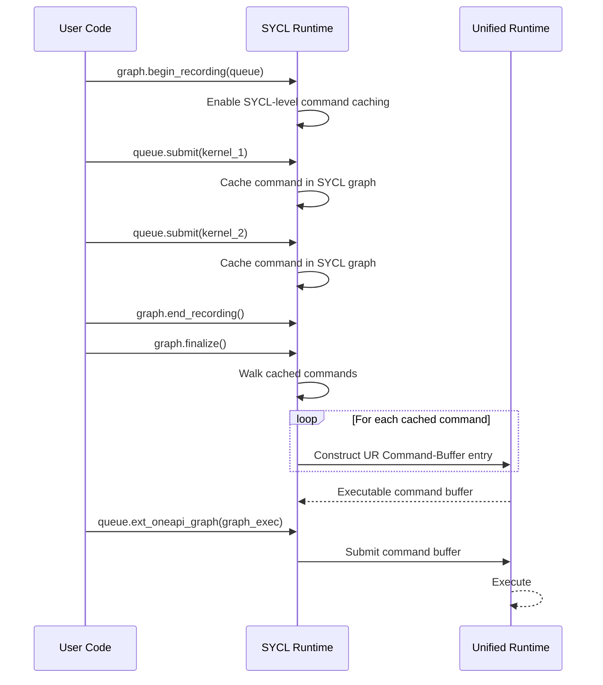
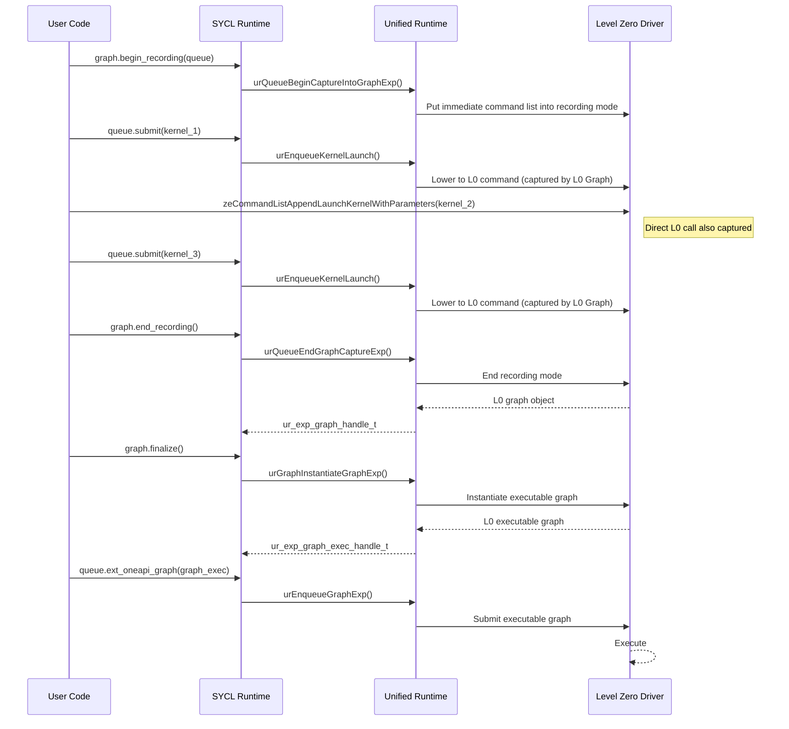

# SYCL Graph Native Recording 
## Introduction

This document describes the design of the proposed 'Native Recording' mode for SYCL Graph. Native Recording
enables SYCL Graph to directly leverage Level Zero Graph APIs during record-and-replay, rather than
going through Unified Runtime's `Command-Buffer` abstraction. 

## Current Architecture 

SYCL Graph currently relies on Unified Runtime's
[Command-Buffer](https://oneapi-src.github.io/unified-runtime/core/EXP-COMMAND-BUFFER.html)
experimental extension. During recording, SYCL commands are cached at the SYCL runtime level. When
`finalize()` is called, the runtime walks the cached command list and manually constructs the
corresponding Unified Runtime Command-Buffer entries, which are then lowered to the backend (e.g.,
Level Zero command lists).




This approach has a few drawbacks:

1. Performance overhead: caching at the SYCL level and then replaying through UR adds latency
   compared to capturing directly by Level Zero.
2. No native interoperability: Level Zero commands issued outside of SYCL (e.g., via
   `zeCommandListAppend*`) cannot be captured into the graph without workarounds such as the SYCL
   native-handle escape hatch, which requires code changes on the user side.
3. Blocking submissions: when submitting multiple copies of a graph to a queue, there needs to be a synchronization between successive executions which is not necessary with native recording.

Level Zero recently introduced a set of experimental APIs that enable graph-level capture of
commands submitted to immediate command lists. This API can be used via Unified Runtime's new
graph API (introduced in [intel/llvm#20860](https://github.com/intel/llvm/pull/20860)) which contains
functions such as `urQueueBeginCaptureIntoGraphExp` and `urEnqueueGraphExp`.

All three drawbacks are addressed using the proposed Native Recording mode for SYCL Graph.

## Design Overview

Our goal is to introduce a Native Recording mode for SYCL Graph that, when enabled, bypasses the UR
Command-Buffer path and instead puts the underlying Level Zero immediate command list into
graph-recording mode (via the new UR Graph API). All commands, whether submitted via SYCL or directly via Level Zero APIs,
are captured by Level Zero and finalized into an executable Level Zero graph.

### High-Level Flow



### Enabling Native Recording

| Phase         | Mechanism                                                                                                  |
|---------------|------------------------------------------------------------------------------------------------------------|
| During Development | Set the environment variable `SYCL_GRAPH_ENABLE_NATIVE_RECORDING=1`.                                    |
| After Release     | Pass a SYCL property to the `command_graph` constructor to opt in to native recording at graph creation. |

When native recording is not enabled, the existing Command-Buffer path is used unchanged.

### Interoperability with Level Zero

A major benefit of native recording is that users can freely mix SYCL submissions with direct Level
Zero API calls within the same recording session. Because the underlying immediate command list is
in L0 graph-recording mode, both SYCL-lowered commands and raw L0 commands are captured into
the same graph.

## 5. Usage Example

The following example shows how an application can use Native Recording to capture a
graph that includes both SYCL and direct Level Zero kernel launches.

### Step 1: Create graph and begin recording

```cpp
using graph_type = sycl::ext::oneapi::experimental::command_graph<>;

auto MyProperties = property_list{
  sycl::ext::oneapi::experimental::property::graph::enable_native_recording{}
 };

auto graph = graph_type(queue, queue.get_device(), MyProperties);
graph.begin_recording(queue);
```

At this point the underlying Level Zero immediate command list is placed into recording mode.


### Step 2: Submit commands (SYCL and/or Level Zero)

```cpp
// Obtain the native L0 command list for direct interop
auto native_queue_variant = sycl::get_native<sycl::backend::ext_oneapi_level_zero>(queue);
ze_command_list_handle_t native_cmdlist = std::get<ze_command_list_handle_t>(native_queue_variant);

// Launch a kernel via Level Zero directly
zeCommandListAppendLaunchKernelWithParameters(
    native_cmdlist,
    hKernel_1,
    launchKernelArgs_1,
    pArguments_1,
    nullptr, 0, nullptr
);

// Launch another kernel
zeCommandListAppendLaunchKernelWithParameters(
    native_cmdlist,
    hKernel_2,
    launchKernelArgs_2,
    pArguments_2,
    nullptr, 0, nullptr
);
```

SYCL kernel submissions via `queue.submit(...)` can be freely interleaved with these direct
L0 calls — all commands are captured into the same graph.

### Step 3: Finalize and execute

```cpp
graph.end_recording();
auto graph_exec = graph.finalize();
queue.ext_oneapi_graph(graph_exec);
```

After `end_recording()`, an executable graph object is created and
`ext_oneapi_graph` submits the graph for execution.

## Limitations

### Future Work

| Limitation          | Description                                                                                                                         |
| ------------------- | ----------------------------------------------------------------------------------------------------------------------------------- |
| SYCL Host tasks | SYCL-level host tasks (as opposed to L0 host tasks) require new runtime support that is currently being developed by the SYCL team. |

If host tasks are needed, directly using `zeCommandListAppendHostFunction` can be used as a workaround until SYCL support is added. Attempting to record via the `sycl::handler::host_task` API will lead to correctness issues in your application.

### Not Supported

| Limitation                               | Description                                                                                                                                              |
| ---------------------------------------- | -------------------------------------------------------------------------------------------------------------------------------------------------------- |
| Graph update / Mutable command lists | Updating a finalized graph (e.g., changing kernel arguments) requires mutable command list support, which is not supported by the Level Zero Graph APIs. |
| Asynchronous memory allocation | Async allocation during recording is not yet supported by Level Zero Graph.                  |
| Explicit graph API             | The explicit (non-record-and-replay) graph construction API is not supported in native mode. |

The following restrictions are inherent to Level Zero Graph and apply to any graph recorded in
native mode:

1. Immediate command lists only: Regular (non-immediate) command list operations are not
   supported during recording.
2. Single root graphs: Graphs with more than one root node (i.e., forests) are not supported in native mode.
3. No synchronous calls: Synchronous waits inside a recording session are not permitted.
4. All forks must be joined: Every divergent path in the graph must reconverge. For example,
   if two queues exist and one is in recording mode while the other is not, any commands submitted
   to the non-recording queue must be synchronized back through the recording queue before the
   recording ends. 

